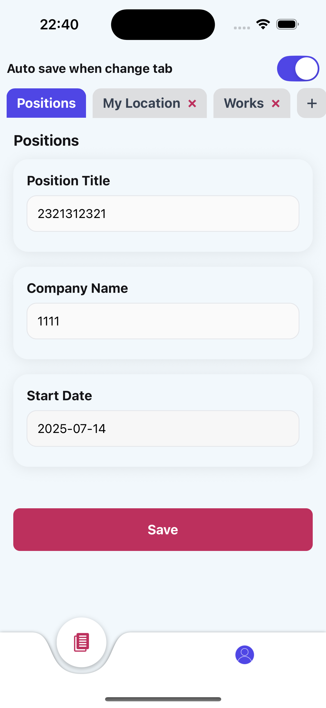

## UI Screenshots

Below are some screenshots of the main features in **DynamicFormApp**:

### Builder Tab

<div style="display: flex; gap: 16px">
  <div>
    <b>Default Positions Category</b><br/>
    
  </div>
  <div>
    <b>Custom Category Example</b><br/>
    
  </div>
  <div>
    <b>Remove Category Tab</b><br/>
    
  </div>
  <div>
    <b>Custom Category with Date Section</b><br/>
    
  </div>
  <div>
    <b>Save Success Notification</b><br/>
    
  </div>
</div>

### Profile Tab

<div style="display: flex; gap: 16px">
  <div>
    <b>Profile Form</b><br/>
    
  </div>
  <div>
    <b>Profile Validation Error</b><br/>
    
  </div>
</div>

# DynamicFormApp

## Installation & Build Instructions

### 1. Prerequisites
- **Node.js** >= 20 (recommended: [fnm](https://github.com/Schniz/fnm))
- **Yarn** (recommended, or [bun](https://bun.sh/))
- **Ruby** 3.2.2 (recommended: [rbenv](https://github.com/rbenv/rbenv))
- **Xcode** (for iOS, on macOS)
- **Android Studio** (for Android)

### 2. Installation
```bash
# Clone project
$ git clone https://github.com/thiendangit/DynamicForm
$ cd DynamicFormApp

# Install dependencies
$ yarn

### 3. Running the App
- **Android:**
  ```bash
  yarn android:dev
  ```
- **iOS:**
  ```bash
  yarn ios:dev
  ```
- **Start Metro server:**
  ```bash
  yarn start
  ```

> **Note:**
> - Make sure you have set up the React Native CLI environment: [React Native CLI Setup](https://reactnative.dev/docs/environment-setup)
> - If you get an error in Xcode about node not found, add PATH to your `.bash_profile` and run `source ~/.bash_profile` in the Pre-actions of your Xcode scheme (see detailed instructions below).

### 4. Running on Real Devices
- **Android:** Connect your device via USB, enable developer mode, and verify with `adb devices`.
- **iOS:** Connect your device, select it in Xcode or use `yarn ios:dev` (requires proper provisioning profile and permissions).

## Assumptions & Notes
- The app uses React Native CLI, not Expo Go.
- Environments (env) for dev/prod are pre-configured; you can add new ones as guided in the README.
- All Builder tab data is stored locally (local-storage), no backend.
- Profile tab data is also stored locally.
- The app supports multi-language (i18n), default is English.

## Design Overview & Architectural Decisions

### Architecture Overview
- The app uses **React Native** with a clear modular structure: screens, components, hooks, services, model, themes, zustand (state management), utils.
- Navigation is handled by **@react-navigation** (bottom tab navigator).
- Local state uses hooks, global state (if needed) uses **zustand**.
- UI styling uses **react-native-unistyles**.
- Multi-language support with **i18next** and **react-i18next**.

### React Hook Form & Zod
- **React Hook Form** is used for form management in both Builder and Profile tabs.
- **Zod** is used for schema validation (via `zodResolver`).
- Dynamic fields (Builder tab) use `useFieldArray` to manage arrays of sections/tabs.
- When users switch tabs or press save, the form data is validated and saved to local-storage.

### Local-storage persistence (Builder tab)
- **react-native-mmkv** is used for fast and secure local storage.
- When opening the Builder tab, data is loaded from local-storage (if available).
- When switching tabs or pressing save, data is automatically saved (auto-save can be toggled).
- All load/save logic is in: `src/app/screens/builder/Builder.viewModel.ts` and `src/app/library/utils/storage/index.ts`.

### Main Libraries Used
- **react-native**: core platform
- **react-hook-form**: form management
- **@hookform/resolvers** + **zod**: form validation
- **react-native-mmkv**: local-storage
- **@react-navigation/native**, **@react-navigation/bottom-tabs**: navigation
- **zustand**: state management
- **react-native-unistyles**: styling system
- **i18next**, **react-i18next**: internationalization
- **dayjs**: date handling
- **react-native-ui-datepicker**: date picker
- **@gorhom/portal**, **expo-font**, **react-native-vector-icons**, ...

## Additional Notes
- For more details on build commands, environments, splash, app icon, see the sections below in this README.
- Please read the "Importance before commit" section to ensure clean and standard code.

---

## Folder Structure

```
DynamicFormApp/
├── android/           # Android native project
├── ios/               # iOS native project
├── src/
│   └── app/
│       ├── common/    # Shared utilities, hooks, constants, regex, etc.
│       ├── library/   # Reusable UI components, networking, utils
│       ├── model/     # TypeScript types and models
│       ├── navigation/# Navigation setup (navigators, services)
│       ├── screens/   # App screens (Builder, Profile, ...)
│       ├── services/  # Business logic/services
│       ├── themes/    # Theme, color, typography
│       └── zustand/   # State management (selectors, stores)
├── assets/            # Images, icons, fonts, splash, app icons
├── declare/           # TypeScript global types and helpers
├── env/               # Environment config files
├── scripts/           # Custom scripts for build, setup, splash, etc.
├── fastlane/          # Fastlane config for CI/CD
├── patches/           # Patch files for dependencies
├── ...                # Other config files (package.json, tsconfig.json, etc.)
```

### Key Folders Explained

- **android/**, **ios/**: Native project folders for Android and iOS. Only modify if you need to change native code, link native modules, or update build settings.

- **src/app/common/**: Shared logic and utilities (e.g., custom hooks, constants, regex, permission handlers). Add here if logic is reused across multiple features.
  - *Example:* `hooks/`, `constant/`, `request-permission/`

- **src/app/library/**: Reusable UI components (buttons, modals, tabs), networking helpers, and utility functions. Place generic, shareable code here.
  - *Example:* `components/button/`, `networking/api.ts`, `utils/storage/`

- **src/app/model/**: TypeScript types, interfaces, and schemas for data models and form validation. Update when you add new data structures or forms.
  - *Example:* `builder.types.ts`, `profile.types.ts`

- **src/app/navigation/**: Navigation setup, navigators, and navigation helpers. Edit when adding new screens or changing navigation flow.
  - *Example:* `tab-navigator.tsx`, `app-container.tsx`

- **src/app/screens/**: Main app screens and their logic/components. Each feature or screen (e.g., Builder, Profile) has its own folder.
  - *Example:* `builder/`, `profile/`

- **src/app/services/**: Business logic, API services, or authentication logic. Add here if logic is not UI-related and not global state.
  - *Example:* `authentication.ts`, `app.ts`

- **src/app/themes/**: Theme configuration, color palettes, typography, and style presets. Edit to change the look and feel of the app.
  - *Example:* `colors/`, `typography/`, `text-presets/`

- **src/app/zustand/**: State management using Zustand. Contains selectors and stores for global state.
  - *Example:* `stores/app.ts`, `selectors/app.ts`

- **assets/**: Static assets such as images, icons, fonts, splash screens, and app icons. Add new images or fonts here.
  - *Example:* `image/`, `icon/`, `fonts/`, `splash/`, `appicon/`

- **declare/**: Global TypeScript type declarations and helpers. Update if you need to extend or add global types.

- **env/**: Environment configuration files (e.g., API URLs, app name, bundle ID). Add or edit files here to support new environments.

- **scripts/**: Custom Node.js scripts for automation (build, setup, splash generation, etc.).

- **fastlane/**: Fastlane configuration for CI/CD, app store deployment, and release automation.

- **patches/**: Patch files for dependencies (used with patch-package).

- **Other root files**: Project configuration files such as `package.json`, `tsconfig.json`, `babel.config.js`, etc.

---

## Detailed Folder Structure for Screens

### src/app/screens/builder
```
src/app/screens/builder/
├── Builder.styles.ts         # Styles for the Builder screen
├── Builder.tsx               # Main Builder screen component
├── Builder.viewModel.ts      # ViewModel: business logic, state, form handling
├── components/
│   ├── AddCategoryModal.styles.ts   # Styles for AddCategoryModal
│   ├── AddCategoryModal.tsx         # Modal for adding new category/tab
│   └── SectionList/
│       ├── CustomSectionList.styles.ts   # Styles for custom section list
│       ├── CustomSectionList.tsx         # Renders dynamic sections for custom tabs
│       ├── PositionSectionList.styles.ts # Styles for position section list
│       ├── PositionSectionList.tsx       # Renders sections for the default Positions tab
│       └── index.tsx                     # SectionList entry point, chooses which list to render
├── index.ts                      # Entry point for Builder screen (optional, for re-export)
```
- **Builder.tsx**: Main UI for the Builder tab, connects to the ViewModel and renders all components.
- **Builder.viewModel.ts**: Handles form state, validation, local-storage, and business logic for Builder.
- **components/**: Contains all sub-components and their styles, including modals and section lists for dynamic form building.

### src/app/screens/profile
```
src/app/screens/profile/
├── Profile.styles.ts           # Styles for the Profile screen
├── Profile.tsx                 # Main Profile screen component
├── Profile.viewModel.ts        # ViewModel: business logic, state, form handling
├── ProfileForm.schema.ts       # Zod schema for profile form validation
├── components/
│   └── ProfileForm/
│       ├── ProfileForm.styles.ts   # Styles for ProfileForm
│       └── index.tsx               # ProfileForm component (form UI)
├── index.ts                      # Entry point for Profile screen (optional, for re-export)
```
- **Profile.tsx**: Main UI for the Profile tab, connects to the ViewModel and renders the profile form.
- **Profile.viewModel.ts**: Handles state, validation, and local-storage for profile data.
- **ProfileForm.schema.ts**: Zod schema for validating profile form fields.
- **components/ProfileForm/**: Contains the profile form UI and its styles.

---

## In-depth Explanation of Builder & Profile Screen Structure

### Builder Screen (`src/app/screens/builder`)

- **Builder.tsx**
  - The main React component for the Builder tab.
  - Uses the `useBuilderViewModel` hook to get all state, handlers, and form instance.
  - Renders:
    - Auto-save toggle (Switch)
    - Tabs (dynamic, with add/remove)
    - SectionList (dynamic form fields per tab)
    - AddCategoryModal (for adding new tabs)
    - Save button
  - **Props/State:**
    - Receives all data and handlers from the ViewModel, passes them to child components.
    - Handles UI logic only, no business logic.

- **Builder.viewModel.ts**
  - Contains the main business logic and state for the Builder screen.
  - Uses `react-hook-form` for form state, validation, and dynamic fields (`useFieldArray`).
  - Handles:
    - Loading/saving data from/to local-storage (MMKV)
    - Tab management (add, remove, rename, switch)
    - Section management (add, remove, change type)
    - Auto-save logic
    - Validation with Zod
  - **Key Exports:**
    - `form`: The form instance for all Builder data
    - `handlers`: All event handlers for UI actions
    - `selectors`: Derived state for rendering
  - **Extension points:**
    - Add new tab types, section types, or validation rules easily here.

- **components/AddCategoryModal.tsx**
  - Modal dialog for adding a new tab/category.
  - Uses its own local form (with react-hook-form + Zod) for tab name input.
  - Calls `onSubmit` prop with the new tab data.

- **components/SectionList/index.tsx**
  - Decides which section list to render based on tab type ("positions" or "custom").
  - Passes form instance and handlers down to the correct section list component.

- **components/SectionList/CustomSectionList.tsx**
  - Renders dynamic fields for custom tabs.
  - Allows adding/removing sections, changing section type (text/date), editing section titles/values.
  - Uses form methods to update state.

- **components/SectionList/PositionSectionList.tsx**
  - Specialized for the default "Positions" tab (predefined fields).
  - Similar logic to CustomSectionList but with fixed fields.

- **Styles files (.styles.ts)**
  - All UI styling is separated for maintainability and theming.

### Profile Screen (`src/app/screens/profile`)

- **Profile.tsx**
  - Main React component for the Profile tab.
  - Uses `useProfileViewModel` for state and handlers.
  - Renders the `ProfileForm` component and passes current profile data and handlers.

- **Profile.viewModel.ts**
  - Handles profile state, loading/saving from local-storage, and form submission.
  - Provides `profile` data and `handleChange`, `handleSubmit` handlers.

- **ProfileForm.schema.ts**
  - Zod schema for validating profile fields (avatar, first name, last name, email).
  - Used with react-hook-form for instant validation feedback.

- **components/ProfileForm/index.tsx**
  - The actual profile form UI.
  - Uses react-hook-form for field control, validation, and state sync.
  - Calls `onChange` on every field change and `onSubmit` when the user saves.
  - Handles avatar picker, text inputs, and error display.

- **components/ProfileForm/ProfileForm.styles.ts**
  - Styles for the profile form UI.

### Data Flow Example (Builder Tab)
1. User adds a new tab → `AddCategoryModal` collects name → `handleSubmitAddTab` in ViewModel updates state and form.
2. User adds/removes/edits sections → SectionList/CustomSectionList updates form state via react-hook-form.
3. User switches tab or presses Save → ViewModel validates and saves data to MMKV local-storage.
4. On app start, ViewModel loads data from storage and populates the form.

### Customization & Extension
- To add new field types (e.g., dropdown, checkbox), extend the section rendering logic in `CustomSectionList.tsx` and update the Zod schema.
- To add new tabs with special logic, add new tab types and corresponding section list components.
- To add new profile fields, update `ProfileForm.schema.ts` and the form UI.

---

## Troubleshooting

### 1. Xcode run failed with status 127 (node not found)
- **Cause:** Xcode cannot find your node binary because it uses `.bash_profile`.
- **Solution:**
  - Add the following to your `~/.bash_profile`:
    ```bash
    if which rbenv > /dev/null; then eval "$(rbenv init -)"; fi
    PATH=$PATH:/opt/homebrew/bin
    export PATH=$PATH:/usr/local/bin
    ```
  - In Xcode, go to your scheme's Pre-actions and add:
    ```bash
    source ~/.bash_profile
    ```

### 2. Metro server not starting / Port already in use
- **Solution:**
  - Kill all node processes: `killall -9 node`
  - Or restart your computer.

### 3. Android build fails (SDK/NDK not found)
- **Solution:**
  - Make sure Android Studio is installed and ANDROID_HOME is set.
  - Open Android Studio once to let it install all required SDKs.

### 4. iOS pod install errors
- **Solution:**
  - Run `cd ios && bundle install && bundle exec pod install && cd ..`
  - Make sure you have the correct Ruby version (see Prerequisites).

### 5. App does not persist data
- **Solution:**
  - Make sure you are not running in incognito/private mode (for web, if applicable).
  - Check that `react-native-mmkv` is properly linked and installed.

### 6. ESLint or Prettier errors
- **Solution:**
  - Run `yarn lint` and fix all reported issues before committing.

---

## Usage Guide

### Builder Tab
- **Create/Edit Tabs:**
  - Tap the "+" button to add a new category tab. Enter a name and confirm.
  - You can rename a tab by editing the "Tab Name" field at the top.
  - Remove a custom tab by tapping the delete icon (default tabs cannot be removed).
- **Add/Edit Sections:**
  - Inside each tab, add sections (fields) by tapping "Add Section".
  - Each section can be a text or date field (toggle type with the switch).
  - Remove a section by tapping the delete icon next to it.
- **Auto-save:**
  - By default, changes are auto-saved when you switch tabs. You can toggle auto-save at the top right.
  - You can also manually save all data by pressing the "Save" button at the bottom.
- **Persistence:**
  - All your Builder data is stored locally and will be restored when you reopen the app.

### Profile Tab
- **Edit Profile:**
  - Update your avatar, first name, last name, and email.
  - Changes are saved locally when you press the "Save" button.

### Language Switch
- The app supports multiple languages (default: English). To add or switch languages, update the i18n config in `src/app/library/utils/i18n/`.

### Example Workflow
1. Open the app. By default, you start on the Builder tab with a "Positions" category.
2. Add a new tab (e.g., "Education"), add sections like "School Name", "Degree", etc.
3. Switch to Profile tab, update your info, and save.
4. Close and reopen the app: all your data will persist.

---

# Setup

- Setup development environment [React Native CLI](https://reactnative.dev/docs/environment-setup)
- Node version >= 20 (recommended use [fnm](https://github.com/Schniz/fnm))
- We recommended to use [yarn](https://classic.yarnpkg.com/en/docs/install/#mac-stable) or [bun](https://bun.sh/)
- Ruby version: 3.2.2 (recommended use [rbenv](https://github.com/rbenv/rbenv))

> Xcode run failed with status 127
>
> This error occurs when xcode cannot access node. Xcode use .bash_profile, so add PATH to .bash_profile.

Example `.bash_profile`:

```
  if which rbenv > /dev/null; then eval "$(rbenv init -)"; fi
  PATH=$PATH:/opt/homebrew/bin
  export PATH=$PATH:/usr/local/bin
```
